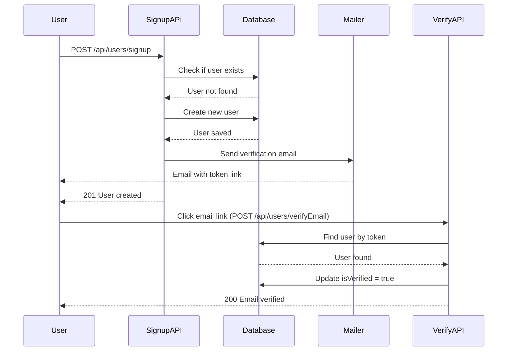

# Email Verification System - Overview

## 📋 Table of Contents
1. [Architecture Overview](#architecture-overview)
2. [User Signup Flow](#user-signup-flow)
3. [Email Verification Flow](#email-verification-flow)
4. [Key Components](#key-components)
5. [Database Schema](#database-schema)
6. [Security Features](#security-features)

---

## Architecture Overview



---

## User Signup Flow

### Step-by-Step Process

**1. User Registration** ([`signup/route.ts`](file:///c:/Users/likit/OneDrive/Desktop/auth-nextjs/my-app/src/app/api/users/signup/route.ts))

```typescript
POST /api/users/signup
Body: { username, email, password }
```

The signup process:
1. ✅ Validates user doesn't already exist
2. ✅ Hashes password using bcryptjs (10 salt rounds)
3. ✅ Creates new user in database with `isVerified: false`
4. ✅ Generates verification token
5. ✅ Sends verification email
6. ✅ Returns success response

**2. Email Sent** ([`mailer.ts`](file:///c:/Users/likit/OneDrive/Desktop/auth-nextjs/my-app/src/helpers/mailer.ts))

The mailer:
- Creates a hashed token from user ID
- Stores token in database with 1-hour expiry
- Sends email with verification link
- Uses Mailtrap for testing (configure for production)

**3. User Clicks Link**

Email contains link: `http://localhost:3000/verifyemail?token=<hashedToken>`

---

## Email Verification Flow

### Step-by-Step Process

**1. Token Verification** ([`verifyEmail/route.ts`](file:///c:/Users/likit/OneDrive/Desktop/auth-nextjs/my-app/src/app/api/users/verifyEmail/route.ts))

```typescript
POST /api/users/verifyEmail
Body: { token }
```

The verification process:
1. ✅ Receives token from request body
2. ✅ Finds user with matching token AND valid expiry (`$gt: Date.now()`)
3. ✅ If not found → Returns "Invalid token" error
4. ✅ If found → Updates user:
   - `isVerfied = true` (Note: typo in model, should be `isVerified`)
   - `verifyToken = undefined`
   - `verifyTokenExpiry = undefined`
5. ✅ Saves user and returns success

---

## Key Components

### 1. **Signup Route** (`/api/users/signup/route.ts`)

| Function | Description |
|----------|-------------|
| Check Existing User | `User.findOne({ email })` |
| Password Hashing | `bcrypt.hash(password, salt)` with 10 rounds |
| Create User | `new User({ username, email, password })` |
| Send Email | `sendEmail({ email, emailType: "VERIFY", userId })` |

---

### 2. **Mailer Helper** (`helpers/mailer.ts`)

| Function | Description |
|----------|-------------|
| **Token Generation** | `bcrypt.hash(userId.toString(), 10)` |
| **Token Storage** | Updates user with `verifyToken` and `verifyTokenExpiry` (1 hour) |
| **SMTP Config** | Mailtrap sandbox (testing) |
| **Email Content** | HTML with verification link |

**Email Types:**
- `"VERIFY"` → Email verification (signup)
- `"RESET"` → Password reset

---

### 3. **Verify Email Route** (`/api/users/verifyEmail/route.ts`)

| Function | Description |
|----------|-------------|
| **Token Validation** | `User.findOne({ verifyToken: token, verifyTokenExpiry: { $gt: Date.now() } })` |
| **Update User** | Set `isVerfied = true`, clear tokens |
| **Response** | Success or error message |

---

## Database Schema

### User Model ([`models/userModel.js`](file:///c:/Users/likit/OneDrive/Desktop/auth-nextjs/my-app/src/models/userModel.js))

```javascript
{
  username: String (required, unique)
  email: String (required, unique)
  password: String (required, hashed)
  isVerified: Boolean (default: false)  // ⚠️ Note: typo in code as "isVerfied"
  isAdmin: Boolean (default: false)
  
  // Email Verification
  verifyToken: String
  verifyTokenExpiry: Date
  
  // Password Reset
  forgotPasswordToken: String
  forgotPasswordExpiry: Date
}
```

---

## Security Features

### 🔒 Security Measures Implemented

1. **Password Security**
   - Passwords hashed with bcryptjs (10 salt rounds)
   - Never stored in plain text

2. **Token Security**
   - Tokens are hashed using bcryptjs
   - Time-limited (1 hour expiry)
   - Single-use (cleared after verification)

3. **Token Expiry Check**
   - MongoDB query: `verifyTokenExpiry: { $gt: Date.now() }`
   - Prevents use of expired tokens

4. **Email Uniqueness**
   - Checks if user exists before creating account
   - Prevents duplicate registrations

---

## 🔧 Configuration Required

### Environment Variables

Create `.env.local` file:

```env
# MongoDB
MONGO_URI=your_mongodb_connection_string

# Domain
DOMAIN=http://localhost:3000

# Email (Mailtrap for testing)
EMAIL_USER=your_mailtrap_user
EMAIL_PASSWORD=your_mailtrap_password

# For production, use Gmail/SendGrid/AWS SES
```

---

## 🐛 Known Issues

1. **Typo in User Model**: `isVerfied` should be `isVerified` (line 24 in verifyEmail route)
2. **Mailtrap Configuration**: Using sandbox credentials (should be environment variables)
3. **Missing Frontend**: Need to create `/verifyemail` page to handle the token

---

## 📝 Next Steps

- [ ] Fix typo: `isVerfied` → `isVerified`
- [ ] Create frontend page at `/verifyemail` to capture token from URL
- [ ] Move Mailtrap credentials to environment variables
- [ ] Add user notification on successful verification
- [ ] Consider adding "Resend verification email" feature
- [ ] For production: Replace Mailtrap with production email service (Gmail/SendGrid/AWS SES)

---

## 🎯 Quick Reference

| Endpoint | Method | Purpose |
|----------|--------|---------|
| `/api/users/signup` | POST | Register new user + send verification email |
| `/api/users/verifyEmail` | POST | Verify email with token |

**Token Lifetime:** 1 hour (3600000 ms)  
**Email Service:** Mailtrap (testing)  
**Token Hash Algorithm:** bcryptjs
